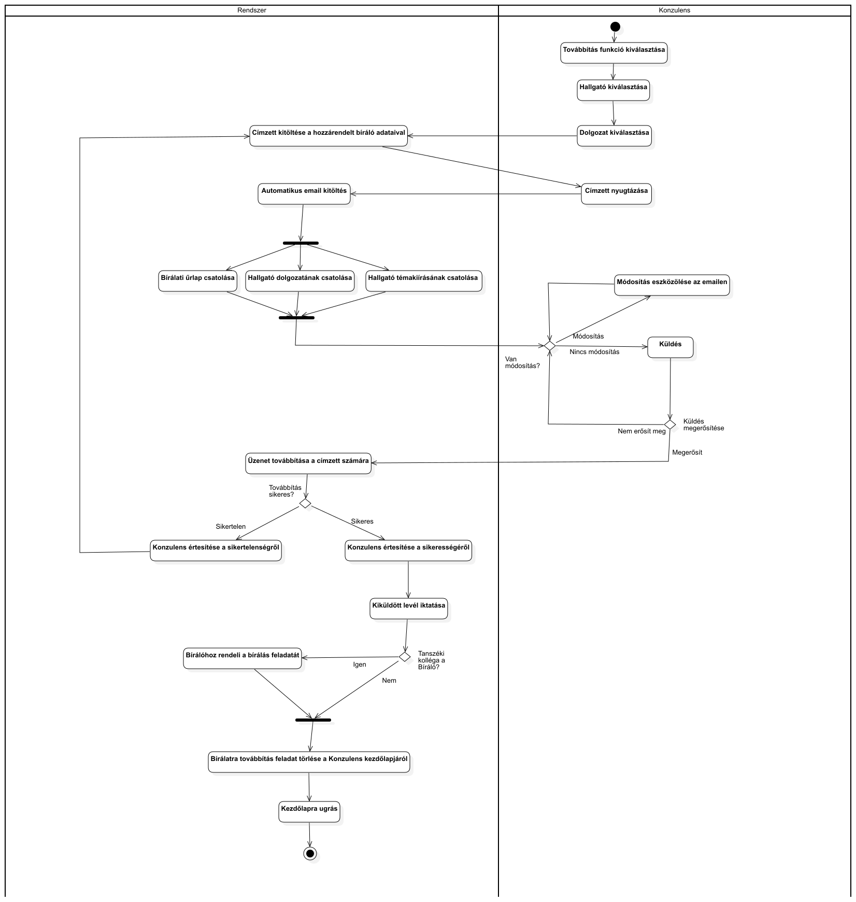

| Második leadás      | ## Szoftvertervezés Házi Feladat | 2023.05.12. |
| :---                |               :----              | :---        |
| Stock András        | Halasi Péter András              | **Team: HS**|

Feladatunk
 : 11. Két féléves diplomaterv első féléve után a beadott dolgozat kiküldése tanszéki kollégák/bírálók részére (konzulens).

### 1. Feladatrész: USE CASE DIAGRAM

### 2. Feladatrész: System Sequence Diagram

##### UC5: Leadott dolgozat bírálatra továbbítása

