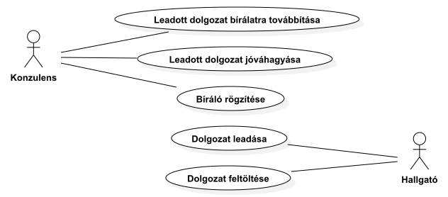

| Első leadás         | ## Szoftvertervezés Házi Feladat | 2023.05.08. |
| :---                |               :----:             | :---        |
| Stock András        | Halasi Péter András              | **Team: HS**|

Feladatunk
 : 11. Két féléves diplomaterv első féléve után a beadott dolgozat kiküldése tanszéki kollégák/bírálók részére (konzulens).

# Szoftvertervezés házi feladat 1. modul

## Aktorok

###### Hallgató
A **Hallgató** olyan személy, aki az Egyetemmel hallgatói jogviszonyban van és  teljesítette a Szakdolgozat-készítés vagy Diplomatervezés tárgyakhoz tartozó mérföldköveket.

###### Tanszéki kolléga
Az Egyetem egy munkatársa.

###### Konzulens
A Hallgató szakmai támogatásáért és segítéséért felelős Tanszéki kolléga. A diplomamunkák elkészítése során a feladatok kiírásáért, konzultásiók megtartásáért felelős. 

###### Szakvezető
Az Egyetemen a szak vezetéséért és ügyiért felelős munkatárs, a Tanszéki kollégák közül kerül ki.

###### Tanszékvezető
Az Egyetemen a Tanszék vezetéséért és ügyiért felelős munkatárs, a Tanszéki kollégák közül kerül ki.

###### Tanszéki ügyintéző
A Tanszéki ügyekért felelős Tanszéki kolléga

## Másodlagos Aktorok

###### Címtár
Az Egyetem belső rendszere, amely a Hallgatók bejelentkeztetésére szolgál, illetve tárolja a legfontosabb adataikat.

## Fogalmak

###### Ügy
Iktatott, bármilyen üzleti cselekmény. Az Egyetemen végbemenő, hivatalos cselekmények és tevékenységek.

###### Diplomaterv Kiírás / Témakiírás
Természetes nyelven megfogalmatzott dokumentum. Rögzíti a hallgató Diplomatervezés vagy Szakdolgozat-készítés tárgy keretében elkészítendő feladatával kapcsolatban több információt.
- Egy rövid leírását a témával kapcsolatban.
- Dolgozat elkészítése során elvégzendő feladatokat.
- A Konzulens és a Tanszék vagy Szakvezető hitelesítét.

###### Bírálat
Természetes nyelven megfogalmatzott dokumentum. Rögzíti a hallgató Diplomatervezés vagy Szakdolgozat-készítés tárgy keretében elkészített feladatának szakmai szempontok szerinti értékelését.
- A Bírálatnak értékelnie kell, hogy a kiírásban megadott feladatok milyen mértékben és minőségben készültek el.
- A Bírálatot a Bírálati sablon alapján szükséges elkészíteni.
- A Bírálatnak szakmailag kell értékelnie a dolgozatban vázolt eredményeket.
- A Bírálatnak formai szempontból kell értékelni a dolgozat összeállítását.

###### Bíráló
A Szakdolgozat vagy Diplomaterv értékelésére felkért, a munka elkészítésétől jól elhatárolható személy. A bírálónak legalább olyan szintű ISCED besorolású végzettséggel kell rendelkezzen, mint amit az általa bírált mű sikeres megvédésével el lehet érni.

## USE CASE-ek

### USE CASE DIAGRAM

#### USE CASE [UC1]: Dolgozat feltöltése
- Aktorok: Hallgató
- Stakeholders and Interests:
  - Hallgató: Gördülékenyen fel tudja tölteni a dokumentumokat.
- Preconditions:ek:
  - A **Hallgató** be van jelentkezve.
  - Van érvényes témakiírása (tehát volt adatlap, konzulens stb.)
- Success Guarantee:
  - A dolgozat feltöltésre került.
- Main success scenario (or basic flow):
  1. A **Hallgató** kiválasztja a dolgozat feltöltése funkciót.
  2. A **Rendszer** megjeleníti a Feltöltési felületet.
  3. A **Hallgató** behúzza a feltölteni kívánt fájlt vagy Böngésző fájlfeltöltő funkciójával kiválasztja feltöltendő fájlt
  4. A **Rendszer** ellenőrzi a fájl nevét, kiterjesztését és a méretét.
  5. A **Hallgató** megerősíti a feltöltést a mentés gombra kattintással.
  6. A **Rendszer** iktatja a feltöltött dokumentumot.

- Alternatív forgatókönyv:
  - 4/a A **Rendszer** jelzi, hogy a kiválasztott fájl neve nem megfelelő formátumú. A use case a 2. lépéssel folytatódik.
  - 4/b A **Rendszer** jelzi, hogy a kiválasztott fájl kiterjesztése nem megfelelő. A use case a 2. lépéssel folytatódik.
  - 4/c A **Rendszer** jelzi, hogy a kiválasztott fájl mérete nem megfelelő. A use case a 2. lépéssel folytatódik.

- Special requirements:
  - Stabil kommunikáció a szerverrel

- Technology and Data Variation List:
  - Hordozható dokumentum (.pdf) (max. 16 MB)
  - Fájlfeltöltő funkció.

---
#### USE CASE [UC2]: Dolgozat leadása
- Primary Actor: **Hallgató**

- Stakeholders and Interest:
  - **Hallgató**: Gördülékenyen le tudja adni a dolgozatot.

- Preconditions:
  - Feltöltötte a **Hallgató** a dolgozatot és az iktatásra került.
  - A **Hallgató** a megfelelő oldalon van.
  - Kiválasztotta a **Hallgató** a záróvizsga tárgyát

- Success Guarantee:
  - A dolgozat leadásának rögzítése sikeres, a szakvezető és a Konzulens értesítésre kerül.

- Main success scenario (or basic flow):
  1. A **Hallgató** kiválasztja a dolgozat leadása funkciót.
  2. A **Rendszer** iktatja, hogy a dolgozat leadásra került.
  3. A **Rendszer** értesíti a **Hallgató** belső konzulensét.
  4. A **Rendszer** elérhetővé teszi a **Szakvezető** számára az ügyet.  

- Special requirements:
  - Stabil kommunikáció a szerverrel

- Open issues:
  - Látja e a **Szakvezető** az iktatások alapján az iktatás tárgyát?
  - Megkapják-e az értesítést minden iktatás során az ügyben érintetteket az iktató aktor által?  
  - Az érintett aktorok számára legyen elérhető felület ahol az értesítéseiket látják.
  > :memo:: Legyen menthető a rendszerben egy átmeneti állapot a végleges leadás előtt. (A **Rendszer** ne adja le automatikusan a dolgozatot. Kelljen a hallgatónak azzal hitelesíteni-e, hogy rányom a leadás gombra)
  > :memo:: Dipterv1 leadása után nincs zv vagy dipterv 2 után, tehát nem vonatkozik ide a Követelmények 12 §

---
#### USE CASE [UC3]: Bíráló rögzítése
- Primary Actor: **Konzulens**

- Stakeholders and Interest:
  - **Konzulens**: A bíráló rögzítése funkció és a hallgatók listázása funkció gördülékeny.
  - **Konzulens**: A felület valós időben ellenőzi a bevitt adatokat.

- Preconditions:
  - A **Hallgató**nak van érvényes témakiírása.

- Success Guarantee:
  - A **Bíráló** hozzárendelése sikeresen megtörtént.

- Main success scenario (or basic flow):
  1. A **Konzulens** kiválasztja a "**Hallgatók** adminisztrálása” funkciót.
  2. A **Rendszer** megjeleníti a konzultált hallgatókat
  3. A **Konzulens** kiválaszt egy **Hallgatót**
  4. A **Rendszer** megjeleníti a **Hallgatóhoz** köthető adatlapot.
  5. A **Konzulens** kiválasztja a **Bíráló** rögzítése funkciót.
  6. A **Rendszer** megjeleníti a **Bíráló** rögzítése funkciót.
  7. A **Konzulens** megadja a **Bíráló** információit és elérhetőségét (név, email cím, legmagasabb végzettség).
  8. A **Rendszer** ellenőrzi a végzettséget és az emailcímet.

- Extensions (or alternative flows):
  - 5/a A **Rendszer** jelzi, hogy a kiválasztott **Hallgatóhoz** már van bíráló rendelve.

  - 8/a A **Rendszer** jelzi, hogy a megadott email cím nem megfelelő. A use case a 7. ponttól folytatódik.
  - 8/b A **Rendszer** jelzi, hogy a megadott végzettség nem megfelelő. A use case a 7. ponttól folytatódik.

- Special requirements:
  - Stabil kommunikáció a szerverrel
  - Valós idejű adatellenőrzés

- Open Issues:
  - Ha már rögzítve van bíráló a hallgatóhoz, a tanszékvezető tudja módosítani azt.

---
#### USE CASE [UC4]: Leadott dolgozat jóváhagyása
- Primary Actor: **Konzulens**
- Stakeholders and interests:
  - **Konzulens**: Könnyen átlátható felületen tudja ellenőrízni a hallgató adatait és a dolgozatot.
- Preconditions:
  - A **Dolgozat** leadása iktatásra került.
- Success Guarantee:
  - A leadott dolgozat "leadása" jóváhagyásra kerül.
- Main success scenario (or basic flow):
  1. A **Konzulens** kiválasztja a “*Leadott dolgozatok adminisztrálása*” funkciót.
  2. A **Rendszer** megjeleníti az elérhető, leadott dolgozatokat.
  3. A **Konzulens** kiválasztja egy **Hallgató** leadott dolgozatát
  4. A **Rendszer** megjeleníti a **Hallgatóhoz** köthető adatlapot, ahol ott van a dolgozat is.
  5. A **Konzulens** kiválasztja a megerősítés funkciót.
  6. A **Rendszer** iktatja a megerősítést.
  7. A **Rendszer** felveszi feladatként a bírálatra továbbítást.
  8. A **Rendszer** megjeleníti a bírálatra továbbítás funkciót.
  9. A **Konzulens** megerősíti a továbbítás funkciót.
  10. A **Rendszer** a *Leadott dolgozat bírálatra továbbítása* USE CASE 2.-sel folytatja.

- Extensions (or alternative flows):
  - 5/a A **Konzulens** kiválasztja az elutasítás funkciót. A **Rendszer** iktatja az elutasítást. A **Rendszer** értesíti a **Hallgatót** az elutasításról. A use case a **Dolgozat** feltöltésével folytatódik.
  - 9/a. A **Konzulens** nem fogadja el a továbbítás funkciót, a USE CASE a 2. ponttal folytatódik.

- Special requirements:
  - Stabil kommunikáció a szerverrel
  - Beépített pdf olvasó

- Technology and Data Variation List:
  - PDF olvasó

- Open Issues:
  - A PDF olvasó csak néhány oldalt jelenítsen meg (pl. 1-3, 5, 10, 30, utolsó)

---
#### USE CASE [UC5]: Leadott dolgozat bírálatra továbbítása
- Primary Actor: **Konzulens**

- Stakeholders and interests:
  - **Konzulens**: Szeretné gördülékenyen továbbítani a dolgozatot.

- Preconditions:
  - A **Dolgozat** jóváhagyásra került a Konzulens által.

- Success Guarantee:
  - A **Bíráló** megkapja az értesítést és a dokumentumokat.

- Main success scenario (or basic flow):
  1. A **Konzulens** kiválasztja továbbítás funkciót.
  2. A **Rendszer** megjeleníti a továbbító felületet.
  3. A **Konzulens** kiválasztja a **Hallgatót**, majd a továbbítandó dolgozatot.
  4. A **Rendszer** kitölti a címzettet a dolgozathoz rendelt bírálóval.
  5. A **Konzulens** nyugtázza a címzettet.
  6. A **Rendszer** kitölt egy email sablont.
     - Címzett
     - Email törzsébe egy szövegsablon kerül határidőkkel és egyéb szükséges információkkal.
  7. A **Rendszer** csatolja a **Hallgató** témakiírását.
  8. A **Rendszer** csatolja a **Hallgató** dolgozatát.
  9. A **Rendszer** csatolja a bírálati űrlapot.
  10. A **Rendszer** megjeleníti az előnézeti felületet.
  11. A **Konzulens** kiválasztja a küldés funkciót.
  12. A **Rendszer** megjeleníti a küldés megerősítése funkciót.
  13. A **Konzulens** kiválasztja a megerősítés funkciót.
  14. A **Rendszer** továbbítja az üzenetet a címzett számára.
  15. A **Rendszer** értesíti a Konzulenst a továbbítás sikerességéről.
  16. A **Rendszer** iktatja a kiküldött levelet.
  17. A **Rendszer** hozzárendeli a **Bíráló**hoz a bírálás feladatát, amennyiben **Tanszéki Kolléga**.
  18. A **Rendszer** törli a feladatok közül a bírálatra továbbítást.
  19. A **Rendszer** megjeleníti a kezdőlapot.

- Extensions (or alternative flows):
  - 5/a. A **Konzulens** másik címzettet választ, a USE CASE a 6. ponttal folytatódik.
  - 11/a. A **Konzulens** módosítást eszközöl az emailen, a USE CASE a 10. ponttól folytatódik.
  - 12/a. A **Konzulens** nem fogadja el a megerősítést, a USE CASE a 10. ponttól folytatódik.
  - 14/a. A továbbítás nem sikeres, erről a **Konzulens** értesítésre kerül, a USE CASE a 2. ponttól folytatódik.
  - 17/a. A **Bíráló** nem **Tanszéki kolléga**, a USE CASE a 18. ponttól folytatódik.

- Special requirements:
  - Stabil kapcsolat a szerverrel.
  - Gördülékeny felhasználói élmény a felületen.
  - Gyors ellenőrzés az adatoknál.

- Technology and Data Variation List:
  - Hordozható dokumentum (.pdf) (max. 16 MB/db)

- Open issues:
  - Mi történik abban az esetben, ha a bíráló levelezőrendszere visszadobja a rendszerüzenetet, mert olyan (céges) levelező rendszerbe ütközik ami nem engedi be a kívülről érkező üzeneteket?
  - A továbbító felület milyen (beépített) email kliens legyen?

# Szoftvertervezés házi feladat 2. modul

### System Sequence Diagram és Activity Diagram

##### UC5: Leadott dolgozat bírálatra továbbítása

# Szoftvertervezés házi feladat 3. modul

### Kommunikációs diagram

### Design Class Diagram
